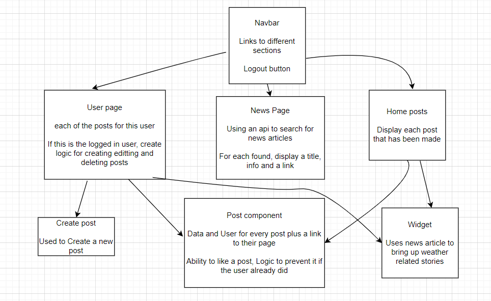

# Creating a Social Media app with React and the Mern Stack

Once upon a time, in the digital realm, a new platform came to life. A social network called K, to encourage open dialogue, creativity, and connection, one K at a time.

### This app mainly focuses on use the mern stack to create a Social media app

### This app will let different users sign in and create posts, each post will be viewable by other users

### It will also be possible to view other profile pages by clicking on their profile on their post

## Some components that are used

### Page to authenticate a user

Used for login and signup features

### Page to display last so many posts shown

### A User page that displays a user based on their Profile

This page will options to edit, delete, and create a post if the page belongs to the logged in user

### Live site

https://k-social-media.onrender.com/News

### React side diagram

### Client side diagram

## Troublesome areas

For the most part, I was able to figure stuff out. One particularly troublesome area was the delete function for posts. Deleting the post itself was not necessarily the problem, it was removing the link from the user.

Luckily a found logic using $pull. I used this on the user's posts list to remove the id
Of course, this only made it null, so I had to whip up some logic that checks to make sure we don't display data for a null value post

Another troublesome part was what to do after creating a new post. After some work, I managed to get it to work by allowing default form operations

A third troublesome spot was attempting to undo liking a post. Adding a like worked just fine. I wanted to increase the like amount and add the user to a list of people who liked the post. The problem was taking the user out when removing. I thought that I would try something similar to what I did with the delete route, but I could not get it to work. In the end, I settled for only allowing liking a post due to time constraints.
